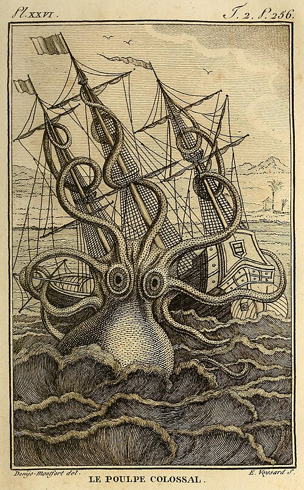

# CSN150-Class1
list
- number 1  
- number 2

## Task List
- [x] completed  
- [ ] not completed  
This is an image  
  
This is a second image  
  
A test one  
Add two spaces at the end of the line to createa a new line  
**Bold**  
*Italics*  
~strikethrough~  
***boldItalics***  
Hello <sub>subscript</sub>  crazy<sup>supscript</sup>  
<ins>underline</ins>  

## Second Level Heading
>This is a quote  
This is how to add code as a comment:  
```
var dog
var cat
console.log(cat + dog)
```

### Third Level Heading
The link is here [Youtube](Https://youtube.com)  
A Relative link goes to a file: [README2.md](/README2.md)
